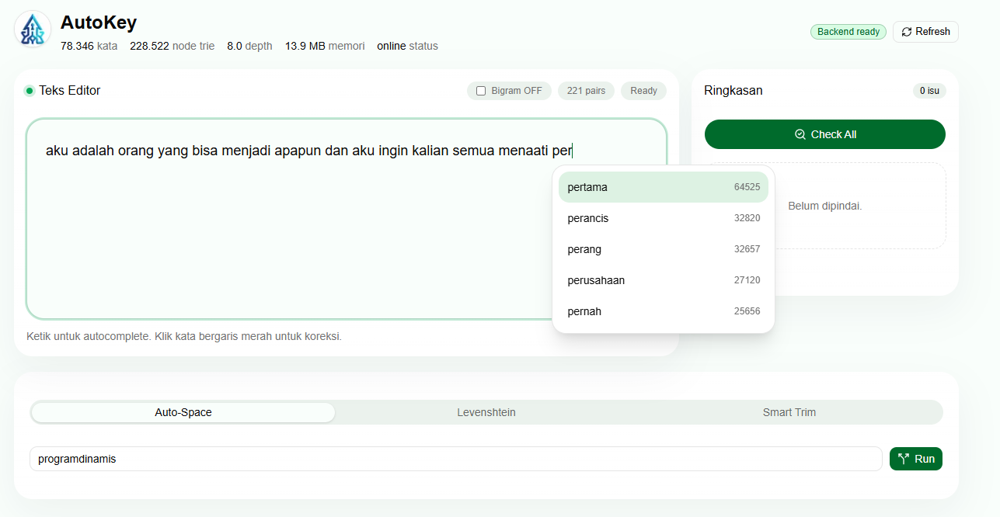
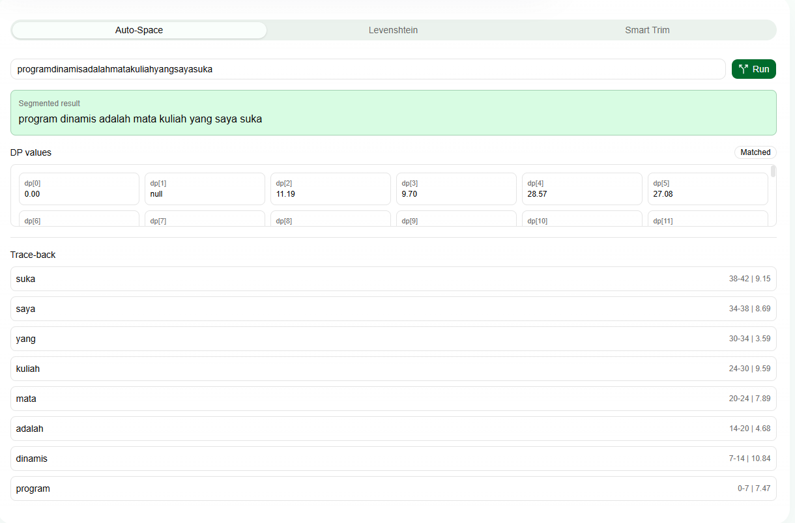
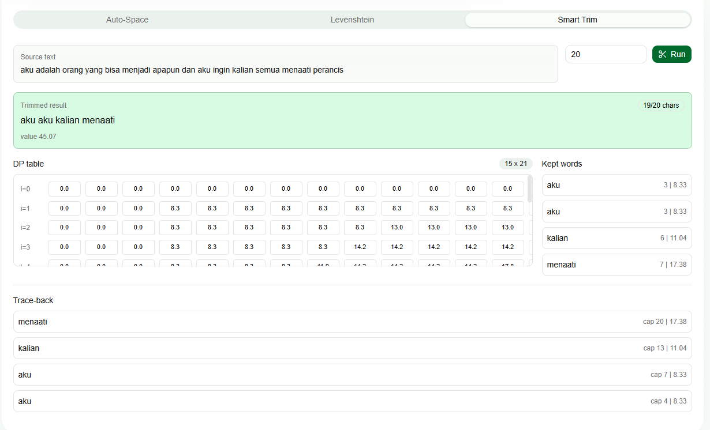

# OHL_AutoKey

AutoKey adalah aplikasi editor teks sederhana untuk autocomplete, pemeriksaan ejaan, dan pemisahan kata otomatis berbasis kamus. Backend memuat `data/kamus.json`, membangun Trie, menghitung saran kata, dan menjalankan dynamic programming untuk Auto-Space. Frontend menyediakan editor interaktif dengan panel statistik, Check All, dan Auto-Space.

## Fitur

- Load dataset kamus dari `data/kamus.json`.
- Trie untuk pencarian prefix dan autocomplete.
- Statistik Trie: jumlah kata, jumlah node, rata-rata depth, dan estimasi memori.
- Validasi kata pada editor.
- Saran koreksi ejaan dengan Levenshtein distance.
- Check All untuk memeriksa seluruh teks dan menampilkan kata tidak valid beserta saran.
- Tambah kata ke kamus runtime session.
- Auto-Space untuk memisahkan string tanpa spasi menggunakan dynamic programming.
- Visualisasi nilai `dp[]` dan trace-back Auto-Space di frontend.
- Smart Trim untuk memendekkan teks berdasarkan batas karakter menggunakan 0/1 Knapsack.
- Bigram Language Model untuk reranking autocomplete berdasarkan konteks kata sebelumnya.

## Tech Stack

- Backend: Python, FastAPI, Pydantic, Pytest.
- Frontend: Next.js, TypeScript, Tailwind CSS, shadcn/ui, lucide-react.
- Dataset: JSON dictionary di `data/kamus.json`.

## Cara Run Backend

Jalankan dari root project:

```powershell
cd backend
python -m venv .venv
.\.venv\Scripts\Activate.ps1
pip install -r requirements.txt
uvicorn app.main:app --reload
```

Backend default berjalan di:

```text
http://localhost:8000
```

Endpoint dokumentasi FastAPI:

```text
http://localhost:8000/docs
```

## Cara Run Frontend

Jalankan dari root project pada terminal lain:

```powershell
cd frontend
npm install
npm run dev
```

Frontend default berjalan di:

```text
http://localhost:3000
```

Jika backend berjalan di URL lain, buat `frontend/.env.local`:

```text
NEXT_PUBLIC_API_BASE_URL=http://localhost:8000
```

## Trie

Trie menyimpan kata berdasarkan karakter per node. Setiap node menyimpan children, penanda akhir kata, dan frekuensi kata. Autocomplete dilakukan dengan mencari node dari prefix, lalu mengumpulkan kata-kata di subtree node tersebut. Hasil saran diurutkan berdasarkan frekuensi terbesar, lalu alfabetis.

Statistik Trie dihitung dari struktur node yang sudah dibangun:

- `word_count`: jumlah kata yang dimasukkan.
- `node_count`: jumlah seluruh node Trie.
- `average_depth`: rata-rata kedalaman akhir kata.
- `estimated_memory_bytes`: estimasi kasar pemakaian memori struktur Trie.

## Levenshtein

Levenshtein distance menghitung jumlah minimum operasi edit untuk mengubah satu kata menjadi kata lain. Operasi yang dihitung adalah insert, delete, dan replace. Backend memakai tabel dynamic programming untuk menghitung jarak tiap kandidat kata terhadap input tidak valid.

Saran koreksi diurutkan berdasarkan:

1. distance paling kecil,
2. frekuensi kata paling besar,
3. urutan alfabetis.

## Word Segmentation

Auto-Space menerima string tanpa spasi, lalu mencari segmentasi kata terbaik berdasarkan kamus. Algoritma memakai dynamic programming:

- `dp[i]` menyimpan biaya terbaik untuk memisahkan prefix sampai indeks `i`.
- Transisi mencoba semua potongan `text[j:i]` yang ada di kamus.
- Trace-back menyimpan potongan kata terpilih agar hasil akhir dapat direkonstruksi.

Frontend menampilkan hasil segmentasi, nilai `dp[]`, dan langkah trace-back.

## Smart Trim

Smart Trim adalah fitur bonus untuk memendekkan teks otomatis. User menentukan batas karakter, lalu sistem memilih subset kata dari teks editor untuk dipertahankan. Tujuannya adalah memaksimalkan total nilai kata tanpa melewati batas karakter.

Fitur ini dimodelkan sebagai 0/1 Knapsack:

- Setiap kata dianggap sebagai item.
- `weight_i` adalah panjang karakter kata ke-`i`.
- `value_i = log(N / freq(word_i))`, dengan `N` sebagai total frekuensi kata di kamus.
- `dp[i][w]` menyimpan value maksimum dari `i` kata pertama dengan kapasitas karakter `w`.

Basis:

```text
dp[0][w] = 0
dp[i][0] = 0
```

Relasi rekurens:

```text
dp[i][w] = max(
  dp[i - 1][w],
  dp[i - 1][w - weight_i] + value_i
)
```

Jika `w < weight_i`, kata tidak bisa dipilih sehingga:

```text
dp[i][w] = dp[i - 1][w]
```

Frontend menampilkan hasil trim, total karakter, total value, kata-kata yang dipertahankan, tabel `dp[][]`, dan trace-back pemilihan kata.

## Bigram Language Model

Bigram Language Model adalah fitur bonus untuk membuat autocomplete menjadi kontekstual. Autocomplete dasar hanya memakai prefix dan frekuensi unigram, sedangkan Bigram menambahkan konteks kata sebelumnya.

Selama sesi berjalan, backend mencatat pasangan kata:

```text
(kata_sebelumnya, kata_saat_ini)
```

Pasangan dicatat saat user menyelesaikan kata, misalnya dengan spasi, tanda baca, atau completion menggunakan `Tab`/`Enter`. Pasangan hanya dihitung jika kedua kata valid menurut kamus.

Probabilitas Bigram dihitung dengan:

```text
P(kata_B | kata_A) =
count(kata_A, kata_B) / total_pasangan_yang_diawali_kata_A
```

Saat toggle Bigram aktif, kandidat autocomplete tetap diambil dari Trie berdasarkan prefix. Setelah itu kandidat diurutkan ulang menggunakan skor:

```text
score = P(candidate | previous_word) * freq(candidate)
```

Jika konteks kata sebelumnya belum punya data Bigram, sistem fallback ke urutan autocomplete biasa berdasarkan frekuensi unigram. UI menyediakan toggle Bigram ON/OFF dan counter jumlah pasangan kata yang tercatat selama sesi backend berjalan.


## Screenshot





## Video Demo

[Link Video Demo](https://drive.google.com/drive/folders/1sxshKHBj3lUo7nBvGc3ejiB_o1u9astn?usp=sharing)

## Referensi

- FastAPI documentation: https://fastapi.tiangolo.com/
- Next.js documentation: https://nextjs.org/docs
- shadcn/ui documentation: https://ui.shadcn.com/
- Levenshtein distance: https://www.geeksforgeeks.org/dsa/introduction-to-levenshtein-distance/
- Trie: https://www.geeksforgeeks.org/dsa/trie-insert-and-search/
